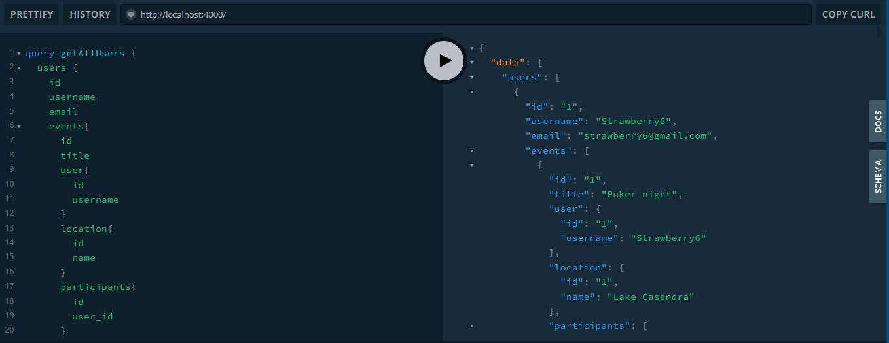

# graphql-exercise-1

Temel olarak User, Event, Location ve Participant tiplerini oluşturmalısınız. Bu tiplerle alakalı fieldları veri seti üzerinden görüntüleyebilirsiniz.
 Bir User'a ait bir veya birden fazla Event olabilir.
 Bir Event, bir User ile ilişkili olmalıdır.
 Bir Event, bir Location ile ilişkili olmalıdır.
 Bir Event birden fazla Participant ile ilişkili olmalıdır.
 Tüm tipler üzerinde tümünü listeleme ve id bazlı bir kaydı getirme Query'leri yazılmalıdır.
Günün sonunda aşağıdaki Query'ler çalışır vaziyette olmalıdır.
