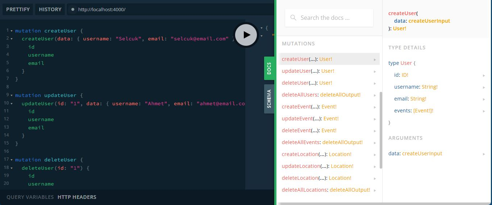

# graphql-exercise-2

Ödev 2
--------------
Yeni bir User ekleyecek Mutation yazılmalıdır.
Bir User'ı güncelleyecek olan Mutation yazılmalıdır.
Bir User'ı silecek olan Mutation yazılmalıdır.
Tüm User'ları silecek olan Mutation yazılmalıdır.
Yukarıdaki maddeler Event, Location ve Participant için de uygulanmalıdır.

Günün sonunda aşağıdaki Mutation'lar çalışır vaziyette olmalıdır:

  mutation addUser   
  mutation updateUser
  mutation deleteUser
  mutation deleteAllUsers

  mutation addEvent   
  mutation updateEvent
  mutation deleteEvent
  mutation deleteAllEvents

  mutation addLocation   
  mutation updateLocation
  mutation deleteLocation
  mutation deleteAllLocations

  mutation addParticipant   
  mutation updateParticipant
  mutation deleteParticipant
  mutation deleteAllParticipants